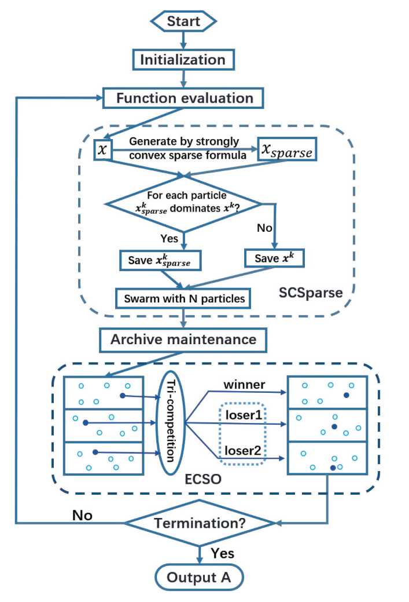

# S-ECSO
[Paper Link](https://ieeexplore.ieee.org/abstract/document/9531955)

This MATLAB code is written by the [PlatEMO](https://github.com/BIMK/PlatEMO) framework.

MOEA-NZD proposes a new perpective in solving ***sparse large-scale multi-objective*** optimization problems by introducing the idea of sub-gradient into sparse optimization, with complete theoretical derivation

This code is from the paper 'An Enhanced Competitive Swarm Optimizer With Strongly Convex Sparse Operator for Large-Scale Multiobjective Optimization', published in 'IEEE TRANSACTIONS ON EVOLUTIONARY COMPUTATION'.

## General framework

## Matlab Version

Required by PlatEMO

## Installation

Users can add this code into the 'PlateEMO/Algorithms/Multi-objective optimization'. 

## Contact

Xiangyu Wang: [xiangyu.wang@uni-bielefeld.de](xiangyu.wang@uni-bielefeld.de) or [xiangyu_wang1216@163.com](xiangyu_wang1216@163.com)
-[Google Scholars](https://scholar.google.com.hk/citations?user=bWW6MRsAAAAJ&hl=zh-CN)
